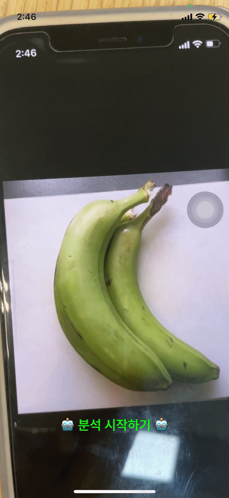

# SmartAI

카메라로 찍은 바나나 사진으로 신선도를 판별하는 iOS 앱입니다. 기기 안 CoreML과 서버의 CNN이 동시에 판별하며, 한쪽이 실패해도 다른 쪽 결과를 활용합니다.

<p align="center">
  
  
</p>
<p align="center">
  <sub>좌: 서버 연결 상태 · 우: 서버 미연결 상태</sub>
</p>

---

## 배경

| 항목 | 내용 |
| --- | --- |
| 과제명 | 스마트 물류 시스템 구축을 위한 AI(CoreML, CNN) 기반 신선식품 품질 판단 프로그램 |
| 소속 | 건국대학교 스마트ICT융합공학과 |
| 성과 | 2022 KU SW경진대회 장려상 🏆 |
| 개발 기간 | 2022.09 ~ 2022.11 (2개월) |
| 팀 구성 | 3인 (iOS · Server · AI), 이 저장소는 iOS 클라이언트만 담고 있습니다 |
| 지원 환경 | iOS 16.0+ · Swift 5 |

신선식품 유통에서 품질 검사는 인력에 의존합니다. 검사자마다 기준이 달라 결과가 달라질 수 있습니다. 이 문제를 CNN 기반 분류 모델로 풀었습니다. 사진 한 장을 찍으면 바나나 숙성 등급이 나옵니다.

물류 현장은 네트워크가 불안정합니다. 그래서 판별 경로를 두 개로 나눴습니다.

| 경로 | 실행 위치 | 모델 | 네트워크 |
| --- | --- | --- | --- |
| 온디바이스 | 기기 | CoreML 이미지 분류기 (Create ML) | 불필요 |
| 서버 | 원격 | CNN | 필요 |

두 경로는 동시에 실행됩니다. 하나가 실패해도 다른 하나는 영향을 받지 않습니다. 네트워크가 끊기면 서버 요청은 아예 나가지 않고, 온디바이스 결과만으로 화면이 완성됩니다.

---

## 아키텍처

단일 타겟 안에서 레이어를 폴더와 프로토콜 소유권으로 나눴습니다. 의존 방향은 항상 안쪽, Domain을 향합니다.

```text
Presentation ─┐
              ├──▶ Domain ◀── Data
Application ──┘   (Entity · Repository 프로토콜 · UseCase)
```

- `Domain`: 앱의 규칙을 담습니다. 프레임워크는 모릅니다. RxSwift만 예외로 둡니다
- `Data`: Domain 프로토콜의 구현체가 있는 곳입니다. Alamofire, Vision, AVFoundation, Network가 여기에만 나옵니다.
- `Presentation`: ReactorKit로 만든 View와 Reactor입니다. 화면 전환은 Coordinator가 맡습니다.
- `Application`: 조립 루트입니다. 세 레이어를 모두 아는 유일한 곳입니다.

```text
SmartAI/
├── Application/          AppDelegate · SceneDelegate · AppDependency
├── Domain/
│   ├── Entity/           BananaGrade · QualityAssessment · InferenceSource
│   │                     CapturedPhoto · ImageOrientation · 에러 타입
│   ├── Repository/       품질 판별 · 카메라 · 네트워크 연결 프로토콜
│   └── UseCase/          판별 · 카메라 세션 유즈케이스와 기본 구현
├── Data/
│   ├── Configuration/    ServerEnvironment
│   ├── DTO/              BananaResponseDTO
│   ├── DataSource/
│   │   ├── Camera/       AVFoundationPhotoCaptureSession
│   │   ├── Network/      Alamofire 기반 API 클라이언트
│   │   └── Vision/       Vision 기반 이미지 분류기
│   ├── Extension/        도메인과 CoreGraphics 사이의 양방향 변환
│   └── Repository/       Domain 프로토콜 구현체
└── Presentation/
    ├── Common/           Coordinator
    ├── Camera/           Reactor · ViewController · PreviewView · Coordinator
    ├── Result/           Reactor · ViewController · Coordinator · SheetDetent
    └── Chart/            ChartView(SwiftUI) · Coordinator
```

### 화면 흐름

```text
AppCoordinator
   └─ CameraCoordinator ── 촬영 ──▶ ResultCoordinator (시트로 제시)
                                        └─ ChartCoordinator (시트 내부 스택에 push)
```

화면 전환은 Coordinator가 맡고, 화면 간 데이터 전달은 Delegate가 맡습니다. 차트는 결과 시트 안의 내비게이션 스택에 쌓입니다. 그래서 `ResultCoordinator`가 차트 전환까지 소유합니다. 스택을 쥔 쪽이 전환도 책임집니다.

---

## 설계 결정

Domain은 RxSwift를 씁니다. UseCase의 경계 타입을 전부 `Single`이나 `Completable`로 뒀습니다. 클로저나 `async`로 순수하게 지키려면 Presentation에서 다시 Rx로 감싸야 하는데, 그 왕복이 아깝다고 봤습니다. 대신 UIKit은 Domain에 절대 들어오지 않습니다. `CapturedPhoto`는 `UIImage`가 아니라 `Data`와 도메인 `ImageOrientation`을 들고 다니고, 이미지 디코딩은 Data 레이어에서만 일어납니다.

차트 화면에는 Reactor를 두지 않았습니다. 액션도 비동기 상태도 없는 화면에 `Action = Never`를 붙이는 건 형식뿐이라, `ChartView`와 `ChartCoordinator`만으로 끝냈습니다.

DataSource 프로토콜도 필요한 곳에만 뒀습니다. `BananaQualityAPIClient`는 서버 없이, `BananaImageClassifying`은 모델 없이 리포지토리를 테스트하려고 만들었습니다. 반면 `NWPathNetworkReachability`와 `AVFoundationPhotoCaptureSession`은 Domain 프로토콜을 바로 구현합니다. 같은 모양의 층을 두 번 쌓을 이유가 없었습니다.

유즈케이스에도 규칙을 담았습니다. 네트워크 연결 여부는 `DefaultRemoteQualityInspectionUseCase`가 판단하고, 상위 네 등급만 보여주는 규칙은 `DefaultOnDeviceQualityInspectionUseCase`가 갖고 있습니다. 둘 다 화면 없이 테스트합니다.

---

## 동시 판별과 경합

결과 화면은 두 판별을 동시에 실행합니다. 콜백 두 개가 같은 배열에 값을 넣으면 순서도 결과도 보장할 수 없습니다. `ResultReactor`는 이 문제를 세 가지 장치로 막습니다.

```swift
case .viewDidLoad:
    return .merge(
        inspection(onDeviceInspection.execute(photo: photo)),
        inspection(remoteInspection.execute(photo: photo))
    )

private func inspection(_ source: Single<QualityAssessment>) -> Observable<Mutation> {
    source.asObservable()
        .map(Mutation.appendAssessment)
        .catch { .just(.setFailure(QualityInspectionError($0))) }
}

func transform(mutation: Observable<Mutation>) -> Observable<Mutation> {
    mutation.observe(on: mutationScheduler)
}
```

1. 각 스트림 안에 `catch`를 둬서 실패를 따로 막습니다. 서버가 죽어도 온디바이스 결과는 그대로 남습니다.
2. `transform(mutation:)`이 모든 mutation을 한 스케줄러로 모읍니다. `reduce`는 그 안에서 하나씩만 실행됩니다.
3. `reduce`는 출처(`InferenceSource`)로 기존 판정을 걸러내고 새로 더합니다. 같은 출처가 두 번 와도 중복되지 않습니다.

`mutationScheduler`는 주입할 수 있습니다. 테스트는 `CurrentThreadScheduler`를 넣어 비동기 대기 없이 상태 변화를 확인합니다.

---

## 테스트

XCTest 위에 Given/When/Then을 얇게 얹었습니다. `XCTContext.runActivity`를 쓰기 때문에 테스트 리포트에도 시나리오가 그대로 남습니다.

```swift
func test_한쪽_실패가_다른쪽_결과를_취소하지_않는다() {
    let (reactor, _, _) = given("서버는 실패하고 온디바이스는 성공한다") {
        makeSUT(onDevice: .just(onDeviceAssessment),
                remote: .error(QualityInspectionError.networkUnavailable))
    }

    when("viewDidLoad 액션을 보낸다") {
        reactor.action.onNext(.viewDidLoad)
    }

    then("온디바이스 판정은 남고 실패만 별도로 전달된다") {
        XCTAssertEqual(reactor.currentState.assessments, [onDeviceAssessment])
        XCTAssertEqual(reactor.currentState.failure, .networkUnavailable)
    }
}
```

테스트 38개가 서버, 카메라, CoreML 없이 전부 시뮬레이터에서 실행됩니다. 화면의 생김새도 스크린샷 대신 코드로 고정했습니다. 촬영 버튼이 하나뿐인지, 폰트가 Pretendard SemiBold 22pt인지, 고정 크기에서 버튼 하단이 774pt인지를 확인합니다.

```bash
xcodebuild -project SmartAI.xcodeproj -scheme SmartAI \
  -destination 'platform=iOS Simulator,name=iPhone 14 Pro' test
```

`ENABLE_TESTABILITY`는 Debug에서만 켜집니다. 테스트는 Debug 구성에서 돌려야 합니다.

---

## 시작하기

```bash
git clone <repository>
cd konkuk-capstone
open SmartAI.xcodeproj
```

의존성은 SPM이 알아서 받습니다. 별도 설정 없이 바로 빌드됩니다.

서버 주소는 `SmartAI/Supporting Files/Configuration/Server.xcconfig`에 기본값이 들어 있습니다. 실제 주소를 쓰려면 같은 폴더에 `Server.local.xcconfig`를 만들어 주세요(gitignore 대상입니다).

```text
SERVER_BASE_URL = http:/$()/실제-호스트:8000/predict
```

`$()`는 `//`가 xcconfig 주석으로 읽히지 않게 끊어주는 장치입니다. `#include?`로 불러오기 때문에 파일이 없어도 빌드는 그대로 통과합니다.

### 알아둘 제약

- 온디바이스 추론은 실기기에서만 됩니다. Create ML sceneprint 모델은 시뮬레이터에서 추론 컨텍스트를 못 만들어 Vision이 `Code=9 "Could not create inference context"`로 실패합니다. 시뮬레이터에서는 크래시 대신 `classificationUnsupported` 에러로 처리됩니다.
- 카메라도 실기기가 필요합니다. 시뮬레이터에는 캡처 디바이스가 없어 세션 구성이 `captureDeviceUnavailable`로 끝납니다. 촬영 버튼을 눌러도 크래시하지 않고 `sessionNotConfigured`로 흘러갑니다.

---

## 기술 스택

| 영역 | 사용 |
| --- | --- |
| UI | UIKit(코드 기반) · SnapKit · SwiftUI + Swift Charts |
| 아키텍처 | Clean Architecture · ReactorKit · Coordinator · Delegate |
| 비동기 | RxSwift · RxCocoa |
| ML | CoreML · Vision |
| 카메라 | AVFoundation |
| 네트워크 | Alamofire · Network(NWPathMonitor) |
| 테스트 | XCTest · RxTest · RxBlocking |

의존성 버전은 `Package.resolved`로 고정했습니다. Alamofire 5.6.2 · ReactorKit 3.2.0 · RxSwift 6.5.0 · SnapKit 5.6.0을 씁니다.

---

## 작성자

이건우 — iOS 클라이언트 전체 구현
